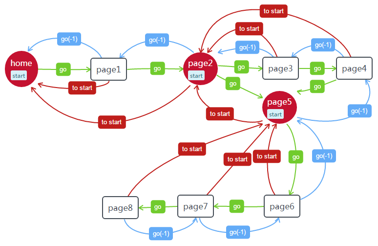

# vue-router c端页面跳转

## demo预览
[demo](https://misszhoudada.github.io/#/)

> A Vue.js project
## Build Setup

``` bash
# install dependencies
npm install

# serve with hot reload at localhost:8080
npm run dev

# build for production with minification
npm run build

# build for production and view the bundle analyzer report
npm run build --report
```

For a detailed explanation on how things work, check out the [guide](http://vuejs-templates.github.io/webpack/) and [docs for vue-loader](http://vuejs.github.io/vue-loader).

## demo 的页面跳转逻辑图


 >图注：
 1. 箭头指向
 - 绿色箭头指向：正常页面层级逐级跳转
 - 蓝色箭头指向：正常页面层级逐级返回跳转
 - 红色箭头指向：页面点击特定按钮返回到层级的起始页面 的跳转
 2. 图框
 - 红色：指定的start 层级起始页面
 - 黑色边框：正常页面

**router文件夹下的index.js文件**
```js
<!--在配置每个页面路由的时候给一个 props参数-->
props: route => ({
    start: route.query.s,//用来记录起始页面开始往后的层级数,需要用到跳转的都得加
}),
```
**start页面的跳转方法**
```js
<!--start页面去下一页的时候需要传start参数,并且start都为1-->
goNext(){
  this.$router.push({
    path:"page1?s="+1
  })
}
```
> 当页面跳转到下一页时，点指定按钮返回start页面，直接go(-this.start)就可以跳转到这个start，我们不能改变vue-router所有跳过的路由栈，但是可以记录页面经过的路由位置，就能都达到连跳n级，然后在start页面返回到上一页的时候不会出现跳转到start之后的页面的混乱情况

**当前页面需要做的操作**
```js
<!--接收上一个页面通过props传过来的参数start-->
props:['start'];

<!--
去下个页面的方法,会有两种情况：
1. 页面如果是start页面,使用上面的start页面跳转方法
2. 不是start页面,需要接收上一个页面传过来的start+1，继续去下一页
-->
goNext(){
let start =Number(this.start) +1; 
 this.$router.push({
    path:"page2?s="+start
  })
},
```
> 路由的props配置和传参的规则可参考文档：[https://router.vuejs.org/zh/guide/essentials/passing-props.html](https://router.vuejs.org/zh/guide/essentials/passing-props.html)
> 
**正常的返回上一级**
```js
onClickLeft(){
    this.$router.go(-1);
},
```
**点击X或者指定按钮返回start页面**
```js
onClickRight(){//本demo是点击 C断title导航菜单右边的 X
   this.$router.go(-this.start);//获取到当前页面跳转的start层级,直接跳回到start的初始层级
}
```
> 另外补充知识点：App.vue里面获取路由配置的props可以直接使用“$route.query.s[自定义名称]”获取，详情可下载demo查看源码
---

> 到这基本可以实现路由因为层级多，出现的跳转混乱问题。问题解决的方法有很多种，要是有更好更简单的方法，或者有什么用的不好的地方，欢迎各路大神私信指点。

